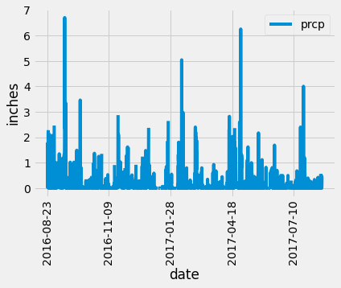
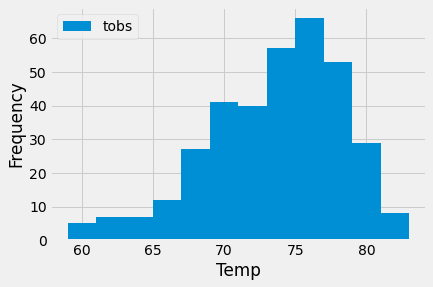
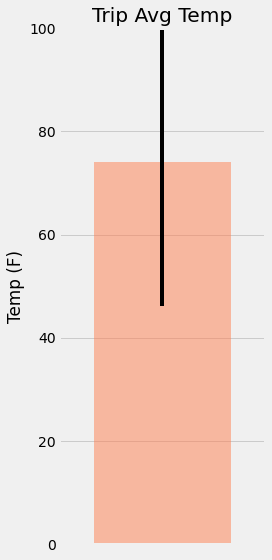
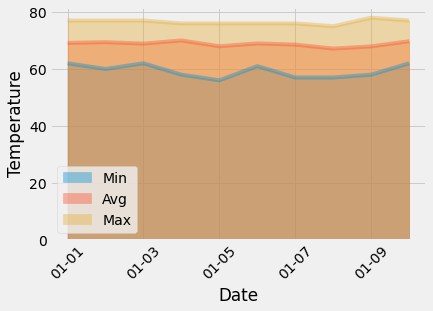

# Climate Analysis for Honolulu

The following project utilizes Python and SQLAlchemy to complete climate analysis and data exploration on the climate database for Hawaii.
A Flask API was then designed using the intitial analysis. 

## Climate Analysis and Exploration

The following analysis was completed completed using SQLAlchemy ORM queries, Pandas, and Matplotlib.

### Precipitation Analysis

* The last 12 months of precipitation data was fround with a query of the database.
* The `date` and `prcp` values were loaded to a Pandas DataFrame.
* The DataFrame was then sorted by `date`.
* I then plotted the results using the`plot` method.
* Finally the summary statistics for the precipitation data was found.

  

### Station Analysis

* A query was developed to calculate the total number of stations in the dataset.
* Then a query to find the most active stations was performed.
  * The lowest, highest, and average temperature was found by query for the most active station
  * The following functions were utilized in the query `func.min`, `func.max`, `func.avg`, and `func.count`

* An additional query to retrieve the last 12 months of temperature observation data was created.
  * The last 12 months of temperature data was found for the station with the highest number of observations and plotted to a histogram with `bins=12`.

    

- - -

## Climate App

I Designed a Flask API based on the queries that were utilized for initial analysis.

### Routes

* `/`

  * Home page.

  * List all routes that are available.

* `/api/v1.0/precipitation`

  * Convert the query results to a dictionary using `date` as the key and `prcp` as the value.

  * Return the JSON representation of your dictionary.

* `/api/v1.0/stations`

  * Return a JSON list of stations from the dataset.

* `/api/v1.0/tobs`
  * Query the dates and temperature observations of the most active station for the last year of data.

  * Return a JSON list of temperature observations (TOBS) for the previous year.

* `/api/v1.0/<start>` and `/api/v1.0/<start>/<end>`

  * Return a JSON list of the minimum temperature, the average temperature, and the max temperature for a given start or start-end range.

  * When given the start only, calculate `TMIN`, `TAVG`, and `TMAX` for all dates greater than and equal to the start date.

  * When given the start and the end date, calculate the `TMIN`, `TAVG`, and `TMAX` for dates between the start and end date inclusive.

- - -

## Other Analyses

### Temperature Analysis I

* Hawaii is reputed to enjoy mild weather all year. In order to determine if there is a meaningful difference between the temperature in June and December I used SQLAlchemy to identify the average temperature in both months. 

* Then I used a t-test to determine whether the difference in the means was statistically significant. An unpaired t-test was utilized to compare the two independent sample months, and a statistical difference was found. 

### Temperature Analysis II

* The `calc_temps` function was used to calculate the min, avg, and max temperatures for my desired trip dates, using the matching dates from a previous year.

* A bar chart was then utilized to plot the min, avg, and max temperature.

    

### Daily Rainfall Average

* I calculated the rainfall per weather station using the previous year's matching dates.

### Daily Temperature Normals

* I then calculate the daily normals for the min, avg, and max temperatures of my trip, with the function `daily_normals`.
* The list was then loaded into a a Pandas DataFrame and an area plot for the daily normals was created. 

  

